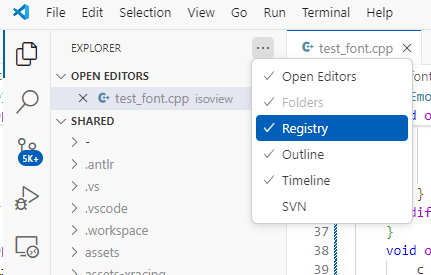

# Visual Studio Code Registry Editor

This extension adds a registry editor to the explorer

To open the extension, enable 'Registry' in the Explorer's context menu.

Keys and Values have context menus allowing deletion, renaming, etc.

Keys can also be exported to a .reg file for large-scale editing; when the reg file is saved its contents are automatically imported into the registry and the view updates accordingly.

## More information

I created this extension really to test the registry library that I needed for something else. I've extracted that test into its own extension in case it's of use to anyone.

This extension is dependent only on the vscode API.

### Contribution Points

Exposes the following commands for inclusion in launch scripts, etc:

| Command | Parameters |
| :----: | :---: |
| regedit.delete    |(key or value) |
| regedit.rename    |(key or value, newname) |
| regedit.createKey |(parent, child) |
| regedit.setValue  |(key, valueName, type, value) |
| regedit.export    |(key, filename) |
| regedit.import    |(filename) |

## Author
Adrian Stephens

