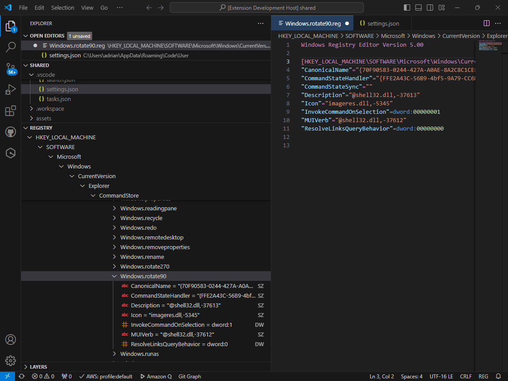

# Visual Studio Code Registry Editor

This extension adds a registry editor to the explorer.

To use, enable 'Registry' in the Explorer's context menu.

Keys and Values have context menus allowing deletion, renaming, etc.

Keys can also be edited via a temporary .reg file. When the reg file is saved its contents are automatically imported into the registry and the view updates accordingly.

## What's New

- Icons and a two-letter 'badge' to help identify the different value types (REG_SZ, REG_DWORD, etc).
- Remote Registry support.
- Copy context command to copy keys and values to the clipboard in a human-readable format.\
    Copy (strict) (available by holding ALT when right-clicking an item) copies values in a format compatible with Windows Registry Editor Version 5.00. This means things like REG_MULTI_SZ are long hex strings.

## More information

I created this extension really to test the registry library that I needed for something else. I've extracted that test into its own extension in case it's of use to anyone.

This extension is dependent only on the vscode API.

### Contribution Points

Exposes the following commands for inclusion in launch scripts, etc:

| Command | Parameters |
| :----: | :---: |
| regedit.delete    |(key or value) |
| regedit.rename    |(key or value, newname) |
| regedit.createKey |(parent, child) |
| regedit.setValue  |(key, name, type, value) |
| regedit.export    |(key, filename) |
| regedit.import    |(filename) |

## Author
Adrian Stephens

